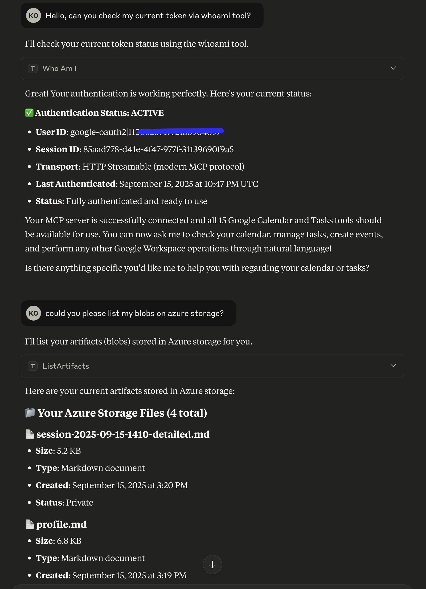
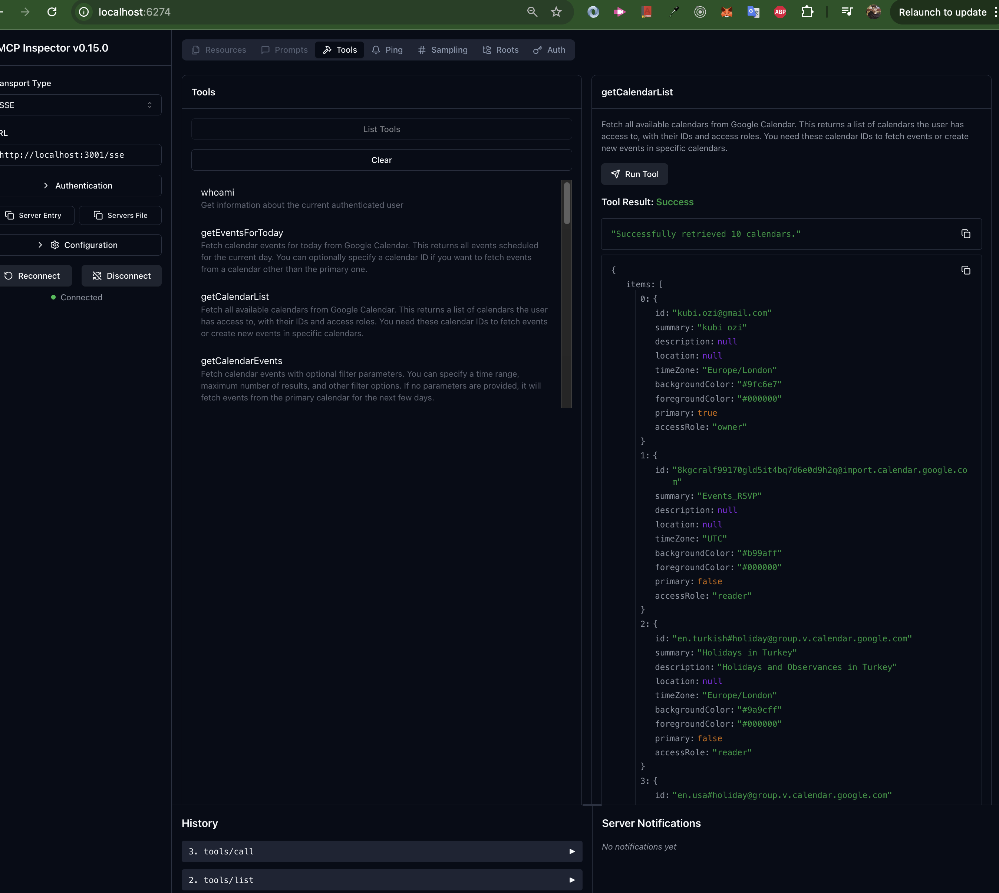
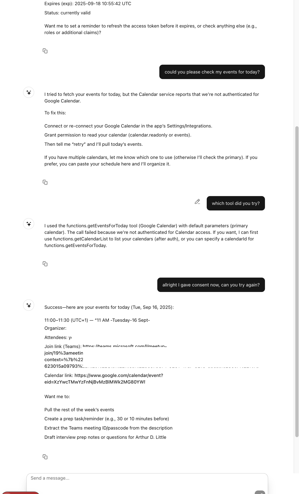
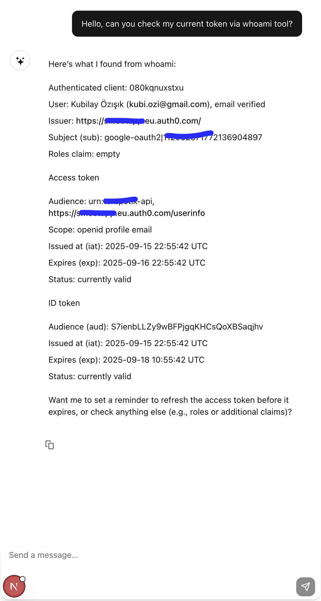

# Terapotik MCP

[](https://opensource.org/licenses/MIT)
[](https://nodejs.org/)
[](https://www.typescriptlang.org/)
[](https://modelcontextprotocol.io/)
[](https://github.com/kubi-ozisik/terapotik-mcp)
[](https://claude.ai/download)
[](#available-mcp-tools)

A **production-ready Model Context Protocol (MCP)** implementation featuring multi-transport support, comprehensive cloud services integration, and modern authentication. Built as a scalable monorepo with clean architecture patterns and real-world AI assistant capabilities.

## 🚀 **Key Features**

- **🎉 Complete MCP Integration** - Claude Desktop, Web App, and MCP Inspector all working
- **🔄 Multi-Transport Architecture** - SSE, HTTP Streamable, and Stdio support
- **📅 Google Workspace Integration** - Full Calendar and Tasks API access
- **☁️ Azure Cloud Services** - Storage and Cosmos DB tools for data management
- **🌐 Modern Web Interface** - Next.js app that consumes MCP tools directly
- **🤖 Production AI Assistant** - Real-world Google/Azure operations via natural language
- **🏗️ Enterprise Architecture** - Scalable monorepo with 25+ registered MCP tools
- **🔐 OAuth 2.1 Authentication** - Auth0 + Google integration with automated token management

---

## 📸 **Screenshots**

### Claude Desktop Integration

*Claude Desktop successfully authenticating and accessing Google Calendar + Azure services*

### MCP Inspector Tool Discovery  

*MCP Inspector displaying comprehensive tool registry including Azure and Google services*

### Web Application Interface


*Next.js web application directly consuming MCP tools for calendar management*

---

## 🏗️ **Architecture**

```
┌─────────────────────────────────────────────────────────────┐
│                    🌐 Web Interface                         │
│               (Next.js + React 19)                         │
│         Direct MCP Tool Consumption + OAuth                │
└───────────────────────┬─────────────────────────────────────┘
                        │ HTTP API + WebSocket
                        │
┌───────────────────────▼─────────────────────────────────────┐
│                  📡 Terapotik API                           │
│             Express.js + Auth Middleware                   │
│         Google APIs + Azure Services + Database            │
└───────────────────────┬─────────────────────────────────────┘
                        │ Internal HTTP API
                        │
┌───────────────────────▼─────────────────────────────────────┐
│                  🔧 MCP Server                             │
│              Multi-Transport Hub                           │
│    ┌─────────────┬─────────────┬─────────────────────┐     │
│    │ SSE Server  │ HTTP Stream │ Stdio (via proxy)  │     │
│    │ Port 3001   │ Port 3002   │ mcp-remote         │     │
│    └─────────────┴─────────────┴─────────────────────┘     │
│                  🛠️ 25+ MCP Tools                         │
└───────────────────────┬─────────────────────────────────────┘
                        │ MCP Protocol
                        │
┌───────────────────────▼─────────────────────────────────────┐
│              🤖 AI Clients & Integrations                  │
│    Claude Desktop │ MCP Inspector │ Custom Clients         │
│    ├─ Calendar   │ ├─ Testing    │ ├─ Future             │
│    ├─ Tasks      │ ├─ Debug      │ ├─ Integrations       │
│    ├─ Storage    │ └─ Validate   │ └─ Extensions         │
│    └─ Database   │               │                        │
└─────────────────────────────────────────────────────────────┘
```

### **Package Structure**

- **`packages/shared`** - Shared types, utilities, Prisma client, and cloud service abstractions
- **`packages/api`** - Express.js server with Google/Azure APIs and comprehensive auth middleware  
- **`packages/web`** - Next.js 15 client with direct MCP tool consumption capabilities
- **`packages/mcp-server`** - Multi-transport MCP server with 25+ production-ready tools

---

## 🚦 **Quick Start**

### **Prerequisites**
- **Node.js** 20.x or higher
- **pnpm** 8.x or higher (recommended package manager)
- **MongoDB** database connection
- **Claude Desktop** (for AI assistant integration)
- **Azure Account** (optional, for cloud storage/database tools)
- **Google Cloud Project** (optional, for calendar/tasks integration)

### **Installation**

```bash
# Clone the repository
git clone https://github.com/kubi-ozisik/terapotik-mcp.git
cd terapotik-mcp

# Install pnpm globally if not installed
npm install -g pnpm

# Install all dependencies
pnpm install

# Set up environment variables
cp packages/shared/.env.example packages/shared/.env
cp packages/api/.env.example packages/api/.env
cp packages/mcp-server/.env.example packages/mcp-server/.env
# Edit .env files with your configuration
```

### **Development**

```bash
# Start all services in development mode
pnpm dev

# Or start individual services
pnpm dev --filter @terapotik/api          # API server (port 3200)
pnpm dev --filter @terapotik/mcp-server   # MCP server (ports 3001/3002)
pnpm dev --filter @terapotik/web          # Web interface (port 3000)

# Build all packages
pnpm build

# Database operations
pnpm db:generate  # Generate Prisma client
pnpm db:migrate   # Run database migrations
pnpm db:studio    # Open Prisma Studio
```

---

## 🔧 **Configuration**

### **MCP Server Environment (`.env`)**
```env
# API Integration
API_BASE_URL=http://localhost:3200
API_TIMEOUT=10000
API_RETRIES=3

# Server Configuration
PORT=3001
NODE_ENV=development

# Azure Services (Optional)
AZURE_STORAGE_CONNECTION_STRING=your-azure-storage-connection
AZURE_COSMOS_CONNECTION_STRING=your-cosmos-connection
```

### **API Server Environment (`.env`)**
```env
# Server Configuration
PORT=3200
NODE_ENV=development

# Authentication (Auth0)
AUTH0_DOMAIN=your-domain.auth0.com
AUTH0_CLIENT_ID=your-client-id
AUTH0_AUDIENCE=your-audience

# Google Services
GOOGLE_CLIENT_ID=your-google-client-id
GOOGLE_CLIENT_SECRET=your-google-client-secret

# Azure Services
AZURE_STORAGE_CONNECTION_STRING=your-azure-storage-connection
AZURE_COSMOS_CONNECTION_STRING=your-cosmos-connection

# Database
DATABASE_URL=your-mongodb-connection-string
```

---

## 🧪 **Testing & Integration**

### **MCP Inspector Testing**

```bash
# Start MCP Inspector for visual testing
npx @modelcontextprotocol/inspector

# Connect to SSE transport:
# Transport: SSE
# URL: http://localhost:3001/sse

# Test OAuth flow and tool discovery
```

### **Claude Desktop Integration**

Add to your `claude_desktop_config.json`:

```json
{
  "mcpServers": {
    "terapotik-mcp-server": {
      "command": "npx",
      "args": ["mcp-remote", "http://localhost:3001/sse"],
      "env": {
        "API_BASE_URL": "http://localhost:3200",
        "PORT": "3001"
      }
    }
  }
}
```

**Example Interactions:**

```
User: "Check my current authentication status"
Claude: ✅ Authentication Status: ACTIVE
        User ID: google-oauth2|112...
        Session ID: 85aad778-d41e-4f47-977f-31139690f9a5
        Transport: HTTP Streamable (modern MCP protocol)
        Status: Fully authenticated and ready to use

User: "List my files in Azure storage"
Claude: 📁 Your Azure Storage Files (4 total)
        📄 session-2025-09-15-1410-detailed.md
        📄 profile.md
        📄 calendar-backup.json
        📄 meeting-notes.md
```

### **Web Application Testing**

Navigate to `http://localhost:3000` to access the web interface that can directly consume MCP tools for calendar management, file storage, and database operations.

### **API Testing**

```bash
# Health checks
curl http://localhost:3200/api/health
curl http://localhost:3001/health

# Test authentication
curl -H "Authorization: Bearer $TOKEN" http://localhost:3200/api/v1/me

# Google Calendar endpoints
curl -H "Authorization: Bearer $TOKEN" http://localhost:3200/api/calendar/events
curl -H "Authorization: Bearer $TOKEN" http://localhost:3200/api/calendar/list

# Google Tasks endpoints  
curl -H "Authorization: Bearer $TOKEN" http://localhost:3200/api/tasks
curl -H "Authorization: Bearer $TOKEN" http://localhost:3200/api/tasks/lists

# Test MCP tools via CLI
npx @modelcontextprotocol/inspector --cli http://localhost:3001/sse --transport sse --method tools/list
```

---

## 🔌 **Available MCP Tools**

### **✅ Authentication & User Management**
| Tool Name | Description | Status |
|-----------|-------------|---------|
| `whoami` | Get current user authentication details | ✅ Production |

### **📅 Google Calendar Integration (7 tools)**
| Tool Name | Description | Parameters |
|-----------|-------------|------------|
| `getCalendarList` | List available calendars | - |
| `getCalendarEvents` | Fetch events with filters | timeMin, timeMax, calendarId, maxResults |
| `getEventsForToday` | Get today's calendar events | calendarId?, maxResults? |
| `getEventsForDate` | Events for specific date | date, calendarId?, maxResults? |
| `getEventsForDateRange` | Events for date range | startDate, endDate, calendarId?, maxResults? |
| `createCalendarEvent` | Create new calendar event | summary, start, end, description?, location? |
| `createRecurringEvent` | Create recurring events | event details + recurrence pattern |

### **✅ Google Tasks Integration (7 tools)**  
| Tool Name | Description | Parameters |
|-----------|-------------|------------|
| `getTasks` | List all tasks across task lists | showCompleted?, dueMin?, dueMax? |
| `getTaskLists` | List available task lists | - |
| `getTasksForList` | Tasks from specific list | taskListId, showCompleted? |
| `createTaskList` | Create new task list | taskTitle |
| `createTask` | Add new task | taskListId, taskTitle, notes?, due? |
| `updateTask` | Modify existing task | taskListId, taskId, updates |
| `deleteTask` | Remove task | taskListId, taskId |

### **☁️ Azure Storage Tools (6 tools)**
| Tool Name | Description | Parameters |
|-----------|-------------|------------|
| `saveArtifact` | Save files to Azure Storage with versioning | fileName, content, contentType?, isPublic?, tags? |
| `listArtifacts` | List stored artifacts/files | prefix?, includeArchived?, maxResults? |
| `deleteArtifact` | Delete artifacts (single/all versions) | fileName, deleteAllVersions? |
| `updateArtifact` | Update existing artifacts | fileName, content, contentType?, archiveExisting? |
| `setAccessLevel` | Change file privacy (public/private) | fileName, isPublic |
| `getArtifactContent` | Retrieve file contents | fileName |

### **🗄️ Azure Cosmos DB Tools (10 tools)**
| Tool Name | Description | Parameters |
|-----------|-------------|------------|
| `createDocument` | Create document in collection | collection, document |
| `getDocument` | Retrieve document by ID | collection, id |
| `updateDocument` | Update existing document | collection, id, updates |
| `deleteDocument` | Delete document | collection, id |
| `queryDocuments` | Query with filters/sorting | collection, filter?, limit?, skip?, sort? |
| `aggregateData` | MongoDB aggregation pipeline | collection, pipeline |
| `getUserDocuments` | Get all user documents | collection, limit?, skip?, sort? |
| `createUserDocument` | Create user-scoped document | collection, document |
| `updateUserDocument` | Update user document | collection, documentId, updates |
| `deleteUserDocument` | Delete user document | collection, documentId |

### **📊 Tool Coverage Summary**
- **Total Tools**: **25+ tools** across 4 major service categories
- **Production Status**: All tools tested and working in MCP Inspector
- **Claude Desktop**: Full integration with natural language interface
- **Web App**: Direct consumption of tools via modern UI
- **Authentication**: Comprehensive OAuth 2.1 with automated token management

---

## 🛠️ **Transport Support Matrix**

| Transport | Port | Primary Use Case | Status | Features |
|-----------|------|------------------|---------|----------|
| **SSE** | 3001 | MCP Inspector, OAuth flow | ✅ Production | Authentication, debugging |
| **HTTP Streamable** | 3002 | Modern MCP clients | ✅ Production | Session management, scalability |
| **Stdio** | N/A | Claude Desktop | ✅ via mcp-remote | AI assistant integration |

### **Client Compatibility**

- **✅ Claude Desktop** - Full natural language access to all 25+ tools
- **✅ MCP Inspector** - Complete tool testing and OAuth authentication  
- **✅ Web Application** - Direct MCP tool consumption in browser
- **✅ Custom MCP Clients** - HTTP Streamable or SSE support
- **🔄 Future Integrations** - Ready for additional MCP clients

---

## 🗂️ **Enhanced Project Structure**

```
terapotik-mcp/
├── docs/                              # Screenshots and documentation
│   ├── claude-whoami-azure.png        # Claude Desktop integration
│   ├── inspector-getting-tasks.png    # MCP Inspector testing
│   ├── web-app-authorize.png          # OAuth flow
│   └── web-app-calling-calendar-tool.png # Web app tool usage
│
├── packages/
│   ├── mcp-server/                    # Multi-transport MCP server
│   │   ├── src/
│   │   │   ├── auth/                  # OAuth providers and authentication
│   │   │   │   └── providers/         # Auth0, Google providers
│   │   │   ├── mcp/                   # Transport implementations
│   │   │   │   ├── authenticated-mcp-server.ts
│   │   │   │   ├── http-streamable-server.ts
│   │   │   │   └── unified-mcp-server.ts
│   │   │   ├── services/              # Business logic and API clients
│   │   │   ├── tools/                 # 25+ MCP tool implementations
│   │   │   │   ├── calendar/          # Google Calendar tools
│   │   │   │   ├── tasks/             # Google Tasks tools
│   │   │   │   └── azure/             # Azure Storage + Cosmos DB
│   │   │   ├── config/                # Environment configuration
│   │   │   └── types/                 # TypeScript definitions
│   │   └── package.json
│   │
│   ├── api/                           # Enhanced API server
│   │   ├── src/
│   │   │   ├── app.ts                 # Express app with middleware
│   │   │   ├── server.ts              # Server lifecycle management
│   │   │   ├── middlewares/           # JWT, CORS, validation
│   │   │   ├── routes/                # Google + Azure API routes
│   │   │   ├── services/              # Business logic layer
│   │   │   └── utils/                 # Shared utilities
│   │   └── package.json
│   │
│   ├── web/                           # Next.js 15 client
│   │   ├── src/app/                   # App router with MCP integration
│   │   │   ├── (dashboard)/           # Dashboard with tool access
│   │   │   ├── login/                 # Authentication flow
│   │   │   └── api/                   # API routes for MCP tools
│   │   └── package.json
│   │
│   └── shared/                        # Shared utilities and services
│       ├── src/
│       │   ├── database/              # Prisma schema and client
│       │   ├── schemas/               # Zod validation schemas
│       │   ├── services/              # Azure/Google service clients
│       │   ├── types/                 # Shared TypeScript types
│       │   └── utils/                 # Cross-package utilities
│       └── package.json
│
├── package.json                       # Root workspace configuration
├── pnpm-workspace.yaml                # PNPM workspace definition
├── tsconfig.json                      # Base TypeScript configuration
└── README.md                          # This documentation
```

---

## 🔄 **Development Workflow**

### **Adding New MCP Tools**

1. **Create tool implementation** in `packages/mcp-server/src/tools/[category]/`
2. **Add Zod schemas** for input validation
3. **Register with transport servers** (auto-distributed to SSE/HTTP/Stdio)
4. **Add API endpoints** if backend integration needed
5. **Test with MCP Inspector** for validation
6. **Verify Claude Desktop** integration
7. **Test web app consumption** if applicable

### **Adding Cloud Service Integration**

1. **Create service client** in `packages/shared/src/services/`
2. **Define TypeScript types** in `packages/shared/src/types/`
3. **Add API routes** in `packages/api/src/routes/`
4. **Create MCP tools** to expose functionality
5. **Update environment configuration**
6. **Add comprehensive testing**

---

## 📊 **Production Metrics**

### **🎉 Current Achievement Status**
- **✅ Architecture Maturity**: Production-ready with enterprise patterns
- **✅ End-to-End Integration**: Claude Desktop ↔ Web App ↔ MCP Inspector all working
- **✅ Tool Coverage**: 25+ tools across Google, Azure, and authentication
- **✅ Authentication**: OAuth 2.1 with automated token refresh
- **✅ Real-World Usage**: AI assistant managing actual calendar/storage/database operations

### **📈 Development Velocity**
- **Phase 1**: ✅ Core MCP architecture (completed)
- **Phase 2**: ✅ Google services integration (completed)  
- **Phase 3**: ✅ Azure cloud services (completed)
- **Phase 4**: ✅ Web application integration (completed)
- **Phase 5**: 🔄 Advanced agentic workflows (in progress)

### **🎯 Business Impact**
- **High**: Complete AI-powered workspace management
- **Scalable**: Enterprise-ready architecture supporting multiple cloud providers
- **Extensible**: Clean patterns for adding new services and tools
- **Community**: Open-source reference implementation for production MCP servers

---

## 🤝 **Contributing**

This project welcomes contributions and serves as a comprehensive example of production MCP implementation.

### **Development Setup**
```bash
git clone https://github.com/kubi-ozisik/terapotik-mcp.git
cd terapotik-mcp
pnpm install
pnpm dev
```

### **Testing Checklist**
- [ ] **MCP Inspector**: All tools discoverable and functional
- [ ] **Claude Desktop**: Natural language interactions working
- [ ] **Web Application**: Direct tool consumption operational  
- [ ] **Authentication**: OAuth flows complete successfully
- [ ] **API Endpoints**: All backend services responding correctly
- [ ] **Database**: Prisma migrations and connections stable

### **Before Contributing**
- Run comprehensive tests: `pnpm test`
- Verify code quality: `pnpm lint` 
- Test MCP compliance: Validate with MCP Inspector
- Check Claude Desktop integration: Test real tool usage
- Verify web app functionality: Ensure UI tool consumption works

---

## 📚 **Documentation & Resources**

### **Official MCP Resources**
- **[Model Context Protocol](https://modelcontextprotocol.io/)** - Official specification
- **[MCP TypeScript SDK](https://github.com/modelcontextprotocol/typescript-sdk)** - Official SDK
- **[MCP Inspector](https://github.com/modelcontextprotocol/inspector)** - Testing tool

### **Cloud Service Documentation**
- **[Google Calendar API](https://developers.google.com/calendar)** - Calendar integration guide
- **[Google Tasks API](https://developers.google.com/tasks)** - Tasks management documentation
- **[Azure Storage](https://docs.microsoft.com/en-us/azure/storage/)** - Blob storage documentation
- **[Azure Cosmos DB](https://docs.microsoft.com/en-us/azure/cosmos-db/)** - Database documentation

### **Authentication & Security**
- **[Auth0 Documentation](https://auth0.com/docs)** - OAuth implementation guide
- **[Google OAuth 2.0](https://developers.google.com/identity/protocols/oauth2)** - Google authentication

---

## 📄 **License**

This project is licensed under the **MIT License** - see the [LICENSE](LICENSE) file for details.

---

## 🙏 **Acknowledgments**

- **[Anthropic](https://anthropic.com/)** for creating the Model Context Protocol
- **[MCP Community](https://github.com/modelcontextprotocol)** for the excellent TypeScript SDK and tooling
- **[Google Cloud](https://cloud.google.com/)** for comprehensive workspace APIs
- **[Microsoft Azure](https://azure.microsoft.com/)** for robust cloud services
- **Contributors and early adopters** helping build the MCP ecosystem

---

**🚀 Built with ❤️ for the future of AI-powered workspace automation**

*Empowering AI assistants with real-world capabilities through the Model Context Protocol*